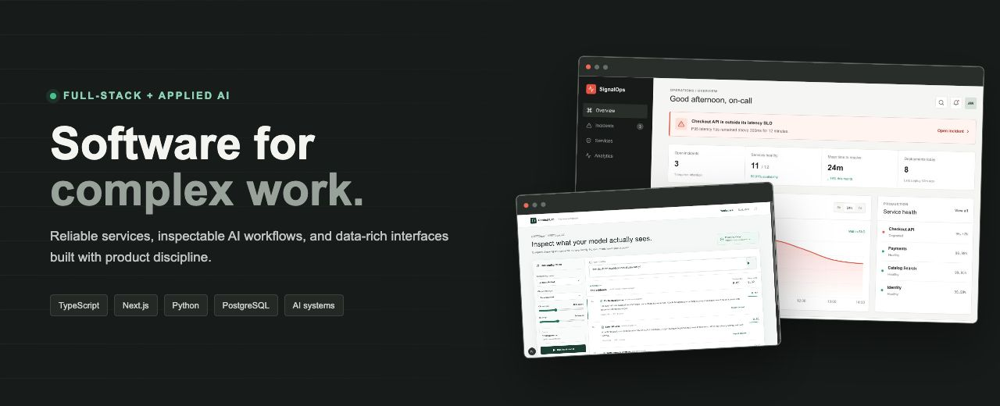

<div align="center">

### Dev-ops products · Applied AI · Developer tooling

I design and build data-rich interfaces, dependable services, and practical AI workflows. My projects focus on the part that matters after the prototype: understandable systems, useful defaults, observable behavior, and a polished experience.

[](https://github.com/abdullahwarrg-png/signalops)
[](https://github.com/abdullahwarrg-png/context-lab)
[](https://github.com/abdullahwarrg-png/shipcheck)

</div>

<div align="center">
  <a href="https://signalops-dusky.vercel.app"><strong>Launch SignalOps ↗</strong></a>
  &nbsp;&nbsp;·&nbsp;&nbsp;
  <a href="https://context-lab-blush.vercel.app"><strong>Open Context Lab ↗</strong></a>
</div>

## Selected work

| Project | What it demonstrates | Stack |
| --- | --- | --- |
| **[SignalOps](https://github.com/abdullahwarrg-png/signalops)** | Incident intelligence cockpit with service health, operational timelines, and explainable AI-assisted summaries. | Next.js, TypeScript, PostgreSQL, Drizzle |
| **[Context Lab](https://github.com/abdullahwarrg-png/context-lab)** | Browser-native retrieval workbench for comparing chunking, embeddings, and ranked evidence. | Next.js, Web Workers, Transformers.js |
| **[Interface Lab](https://github.com/abdullahwarrg-png/interface-lab)** | Accessible React primitives documented as a compact product-grade component system. | React, Storybook, Vitest, axe |
| **[Shipcheck](https://github.com/abdullahwarrg-png/shipcheck)** | CI-friendly repository readiness audits with human and machine-readable output. | Python, Typer, Rich, pytest |
| **[Systems Field Notes](https://github.com/abdullahwarrg-png/systems-field-notes)** | Visual notes about queues, caching, observability, retrieval, and resilient API design. | Astro, Starlight, Mermaid |

## Engineering approach

```text
Understand the system → make the state visible → choose boring boundaries → test the risky paths → ship clearly
```

- Product-minded interfaces that make operational state easy to scan.
- AI features with explicit providers, useful fallbacks, and visible evidence.
- Small, typed boundaries between UI, domain logic, and infrastructure.
- Automated checks that protect behavior, accessibility, and deployment readiness.

## Toolbox

**Product engineering:** TypeScript · React · Next.js · Node.js · Python  
**Data and AI:** PostgreSQL · Drizzle · embeddings · retrieval · evaluation  
**Quality and delivery:** Playwright · Vitest · pytest · GitHub Actions · Vercel

<div align="center">

<sub>Every featured repository includes a working demo or reproducible local setup, architecture notes, and automated checks.</sub>

</div>
